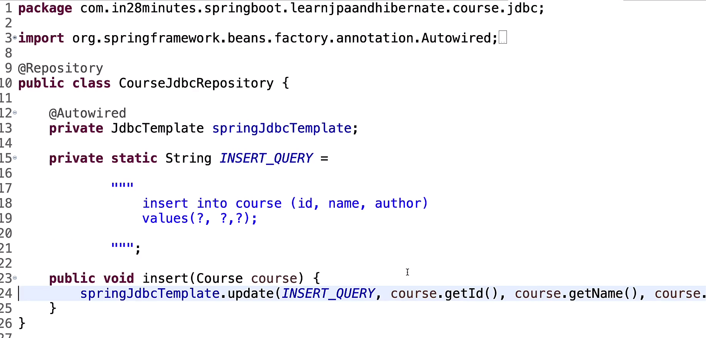

### Spring JDBC:
1. Less java code and more sql code.
2. **JdbcTemplate** is used to execute queries.In below code query can contain delete , insert , update etc.
```java
springJdbcTemplate.update(query, param1, param2);
```
3. Use **@Repository** annotation for Jdbc class 
   
4. question mark and variable are order dependent.
5. Bean is need to be specified in order to get the rows in form of course objects. id is particular column that you want to filter upon. Class should contain setters(or contructor ?) else data will not be initialize.
```java
springJdbcTemplate.queryForObject(selectQuery,new BeanPropertyRowMapper<>(Course.class), id);
```