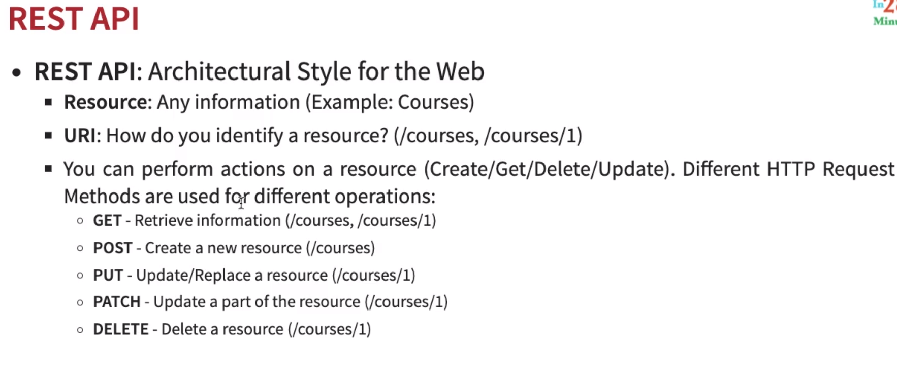

### Rest Api Methods:


1. **Get**
 ```java
@GetMapping("/courses/{id}")
public Course getCourseById(@PathVariable long id) { 
    Optional<Course> filteredCourse = repository.getCourseById(1);
    if (filteredCourse.isEmpty()) {
        throw new RuntimeException("Course not found!");
    }

    return filteredCourse.get();
}
```
2. **Post**
 ```java
@PostMapping("/courses")
public Course getCourseById(@RequestBody Course course) { 
    if(course == null) {
        throw new RuntimeException("Course is null!");
    }

    repository.save(course);
}
```

3. **Put**\
Replace if exists, else inserts(Upsert of a kind). Put is idempotent(run as many times as you want, you will achieve the same result.). 
 ```java
@PutMapping("/courses/{id}")
public Course getCourseById(@PathVariable long id, @RequestBody Course course) { 
    if(course == null) {
        throw new RuntimeException("Course is null!");
    }

    repository.save(course);
}
```